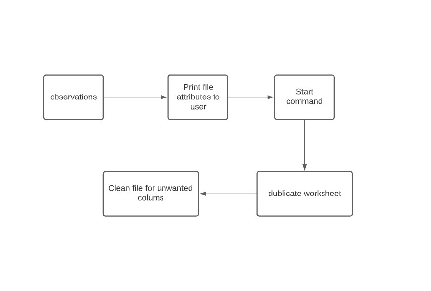
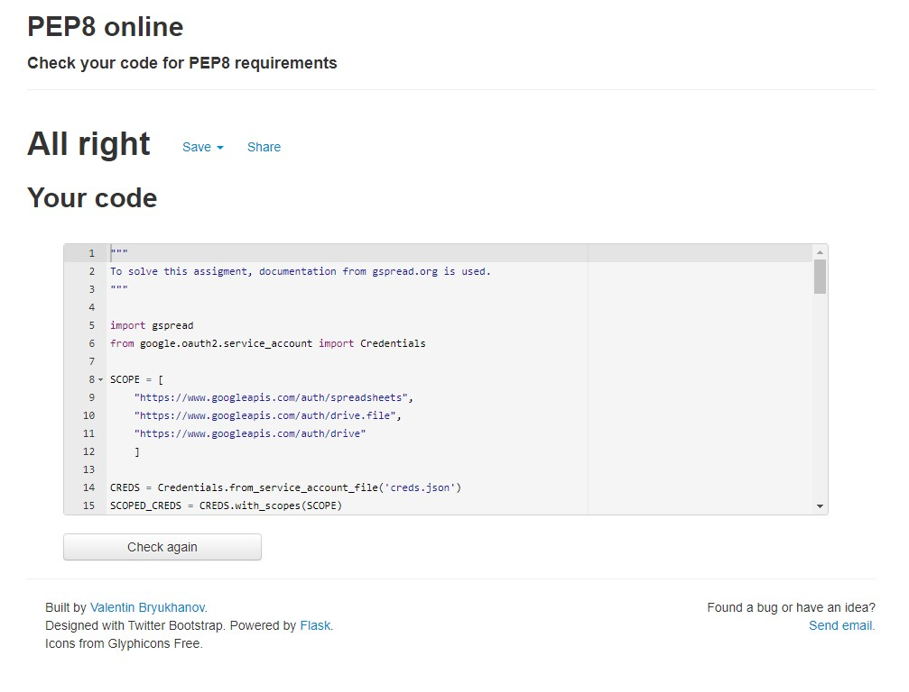

# PP3-ESP
(Developer: Eirik Strøm Pedersen)

## Table of content

1. [Project Goals](#project-goals)
    1. [Background](#background) 
    2. [Goals](#user-goals)
2. [User Experience](#user-experience)
    1. [User Requrements and Expectations](#user-requrements-and-expectations)
3. [Planning](#planning)
    1. [Flowchart](#flowchart)
4. [Technologies Used](#technologies-used)
    1. [Languages](#languages)
    2. [Frameworks & Tools](#frameworks-&-tools)
5. [Features](#features)
    1. [Functions](#functions)
6. [Testing](#validation)
    1. [Function testing](#function-testing)
    2. [Validation](#validation)
8. [Bugs](#Bugs)
    1. [Known bugs](#know-bugs)
    2. [Other issues](#other-issues)
9. [Deployment](#deployment)
10. [Credits](#credits)
11. [Acknowledgements](#acknowledgements)

## Project goals

### Background
As a professional withn the survey industry (land surveying),I come across very many different formats in a weekly basis. Some of them are different file formats, some of them are basic text. Problem is there is hundrets of different formating used on basic text or spreadsheet documents. I want to make an app that cleans up a text file, and make the spreadsheet ready for me to use in a software.

### Goals
- Make a program to handle information stored in a google spreadsheet
- Manipulatin the existing spreadsheet
- Interact with the user via terminal

## User Experience

### User Requrements and Expectations
- The app should explain the process to the user in the terminal
- User interaction should be self explanatory

## Planning

### Flowchart

## Technologies used

### Languages
- Python 3

### Framework & tools
- Gspread (https://docs.gspread.org/en/v5.2.0/)
- GitHub
- GitPod
- vscode
- Lucidchart

## Features

### Functions
- Functions is described in the file using comments.

## Testing

### Function testing
- The application was tested throughout the developemnt process by use of terminal (gitpod.io)

### Validation

- PEP8 (http://pep8online.com/) was used to detect bad writing and errors in the python code.

## Bugs

### Known bugs
- No bugs detected

### Other issues
- No other issues detected

## Deployment
- Depolyment via Heroku (heroku.com) as instructed by CI
- Code is accessible on my github: https://github.com/eirikstrompedersen/PP3_ESP
- Google spreadsheet link: https://docs.google.com/spreadsheets/d/1uzTl6E5M00iVEgspe1o8S34R3D7zXS-9u51n-O4VUVU/edit?usp=sharing. Access to spreadsheet is given to everyone who holds the link.

## Credits

## Acknowledgements
- Thanks to my girlfriend for the patience during the procjet
- Thanks to my mentor for support